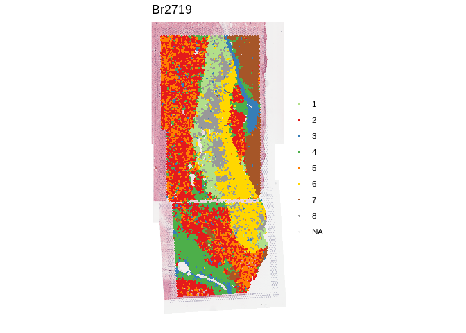

<!-- README.md is generated from README.Rmd. Please edit that file -->

# visiumStitched 

<!-- badges: start -->

[](https://zenodo.org/doi/10.5281/zenodo.13012339)
[](https://github.com/LieberInstitute/visiumStitched/issues)
[](https://github.com/LieberInstitute/visiumStitched/pulls)
[](https://lifecycle.r-lib.org/articles/stages.html#stable)
[](https://github.com/LieberInstitute/visiumStitched/actions/workflows/check-bioc.yml)
[](https://app.codecov.io/gh/LieberInstitute/visiumStitched?branch=devel)
[](https://bioconductor.org/checkResults/release/bioc-LATEST/visiumStitched)
[](https://bioconductor.org/checkResults/devel/bioc-LATEST/visiumStitched)
[](http://bioconductor.org/packages/stats/bioc/visiumStitched/)
[](https://support.bioconductor.org/tag/visiumStitched)
[](https://bioconductor.org/packages/release/bioc/html/visiumStitched.html#since)
[](http://bioconductor.org/checkResults/devel/bioc-LATEST/visiumStitched/)
[](https://bioconductor.org/packages/release/bioc/html/visiumStitched.html#since)
<!-- badges: end -->

`visiumStitched` provides helper functions for working with multiple
Visium capture areas that overlap each other. This package was developed
along with the companion example use case data available from
<https://github.com/LieberInstitute/visiumStitched_brain>.
`visiumStitched` prepares `SpaceRanger` (10x Genomics) output files so
you can stitch the images from groups of capture areas together with
`Fiji`. Then `visiumStitched` builds a `SpatialExperiment` object with
the stitched data and makes an artificial hexogonal grid enabling the
seamless use of spatial clustering methods that rely on such grid to
identify neighboring spots, such as `PRECAST` and `BayesSpace`. The
`SpatialExperiment` objects created by `visiumStitched` are compatible
with `spatialLIBD`, which can be used to build interactive websites for
stitched `SpatialExperiment` objects (check the [example human brain
data](https://libd.shinyapps.io/visiumStitched_brain)). `visiumStitched`
also enables casting `SpatialExperiment` objects as `Seurat` objects.

For details, check the [documentation
site](http://research.libd.org/visiumStitched/).

## Example data processed with visiumStitched

Here is example human brain data from
[LieberInstitute/visiumStitched_brain](https://github.com/LieberInstitute/visiumStitched_brain)
that was stitched together using `visiumStitched`. The resulting data
can be accessed and visualized with
[`spatialLIBD`](https://research.libd.org/spatialLIBD/) version 1.17.8
or newer.

``` r
## Check that you have a recent version of spatialLIBD installed
stopifnot(packageVersion("spatialLIBD") >= "1.17.8")

## Download the spot-level data, which is a SpatialExperiment object
spe <- spatialLIBD::fetch_data(type = "visiumStitched_brain_spe")
#> 2024-07-31 12:06:58.719486 loading file /Users/leocollado/Library/Caches/org.R-project.R/R/BiocFileCache/154352e7328f0_visiumStitched_brain_spe.rds%3Frlkey%3Dnq6a82u23xuu9hohr86oodwdi%26dl%3D1

## Explore the stitched data
spe
#> class: SpatialExperiment 
#> dim: 26369 13965 
#> metadata(0):
#> assays(2): counts logcounts
#> rownames(26369): ENSG00000238009 ENSG00000241860 ... ENSG00000278817
#>   ENSG00000277196
#> rowData names(7): source type ... gene_type gene_search
#> colnames(13965): AAACAACGAATAGTTC-1_V13B23-283_A1
#>   AAACAAGTATCTCCCA-1_V13B23-283_A1 ... TTGTTTGTATTACACG-1_V13B23-283_D1
#>   TTGTTTGTGTAAATTC-1_V13B23-283_D1
#> colData names(40): sample_id in_tissue ... precast_k4 precast_k8
#> reducedDimNames(1): PCA
#> mainExpName: NULL
#> altExpNames(0):
#> spatialCoords names(2) : pxl_col_in_fullres pxl_row_in_fullres
#> imgData names(4): sample_id image_id data scaleFactor

## Show clustering results from PRECAST at k = 8
spatialLIBD::vis_clus(spe, clustervar = "precast_k8", is_stitched = TRUE)
```



## Installation instructions

Get the latest stable `R` release from
[CRAN](http://cran.r-project.org/). Then install `visiumStitched` from
[GitHub](https://github.com/LieberInstitute/visiumStitched) using the
following code:

``` r
if (!requireNamespace("BiocManager", quietly = TRUE)) {
    install.packages("BiocManager")
}

BiocManager::install("LieberInstitute/visiumStitched")
```

## Citation

Below is the citation output from using `citation('visiumStitched')` in
R. Please run this yourself to check for any updates on how to cite
**visiumStitched**.

``` r
print(citation("visiumStitched"), bibtex = TRUE)
#> To cite package 'visiumStitched' in publications use:
#> 
#>   Eagles NJ, Collado-Torres L (2024). _Enable downstream analysis of
#>   Visium capture areas stitched together with Fiji_.
#>   doi:10.18129/B9.bioc.visiumStitched
#>   <https://doi.org/10.18129/B9.bioc.visiumStitched>,
#>   https://github.com/LieberInstitute/visiumStitched/visiumStitched - R
#>   package version 0.99.0,
#>   <http://www.bioconductor.org/packages/visiumStitched>.
#> 
#> A BibTeX entry for LaTeX users is
#> 
#>   @Manual{,
#>     title = {Enable downstream analysis of Visium capture areas stitched together with Fiji},
#>     author = {Nicholas J. Eagles and Leonardo Collado-Torres},
#>     year = {2024},
#>     url = {http://www.bioconductor.org/packages/visiumStitched},
#>     note = {https://github.com/LieberInstitute/visiumStitched/visiumStitched - R package version 0.99.0},
#>     doi = {10.18129/B9.bioc.visiumStitched},
#>   }
#> 
#>   Eagles NJ, Bach S, Tippani M, Ravichandran P, Du Y, Miller RA, Hyde
#>   TM, Page SC, Martinowich K, Collado-Torres L (2024).
#>   "visiumStitched." _bioRxiv_. doi:10.1101/TODO
#>   <https://doi.org/10.1101/TODO>,
#>   <https://www.biorxiv.org/content/10.1101/TODO>.
#> 
#> A BibTeX entry for LaTeX users is
#> 
#>   @Article{,
#>     title = {visiumStitched},
#>     author = {Nicholas J. Eagles and Svitlana Bach and Madhavi Tippani and Prashanthi Ravichandran and Yufeng Du and Ryan A. Miller and Thomas M. Hyde and Stephanie C. Page and Keri Martinowich and Leonardo Collado-Torres},
#>     year = {2024},
#>     journal = {bioRxiv},
#>     doi = {10.1101/TODO},
#>     url = {https://www.biorxiv.org/content/10.1101/TODO},
#>   }
```

Please note that the `visiumStitched` was only made possible thanks to
many other R and bioinformatics software authors, which are cited either
in the vignettes and/or the paper(s) describing this package.

## Code of Conduct

Please note that the `visiumStitched` project is released with a
[Contributor Code of
Conduct](http://bioconductor.org/about/code-of-conduct/). By
contributing to this project, you agree to abide by its terms.

## Development tools

- Continuous code testing is possible thanks to [GitHub
  actions](https://www.tidyverse.org/blog/2020/04/usethis-1-6-0/)
  through *[usethis](https://CRAN.R-project.org/package=usethis)*,
  *[remotes](https://CRAN.R-project.org/package=remotes)*, and
  *[rcmdcheck](https://CRAN.R-project.org/package=rcmdcheck)* customized
  to use [Bioconductor’s docker
  containers](https://www.bioconductor.org/help/docker/) and
  *[BiocCheck](https://bioconductor.org/packages/3.19/BiocCheck)*.
- Code coverage assessment is possible thanks to
  [codecov](https://codecov.io/gh) and
  *[covr](https://CRAN.R-project.org/package=covr)*.
- The [documentation
  website](http://LieberInstitute.github.io/visiumStitched) is
  automatically updated thanks to
  *[pkgdown](https://CRAN.R-project.org/package=pkgdown)*.
- The code is styled automatically thanks to
  *[styler](https://CRAN.R-project.org/package=styler)*.
- The documentation is formatted thanks to
  *[devtools](https://CRAN.R-project.org/package=devtools)* and
  *[roxygen2](https://CRAN.R-project.org/package=roxygen2)*.

For more details, check the `dev` directory.

This package was developed using
*[biocthis](https://bioconductor.org/packages/3.19/biocthis)*.
