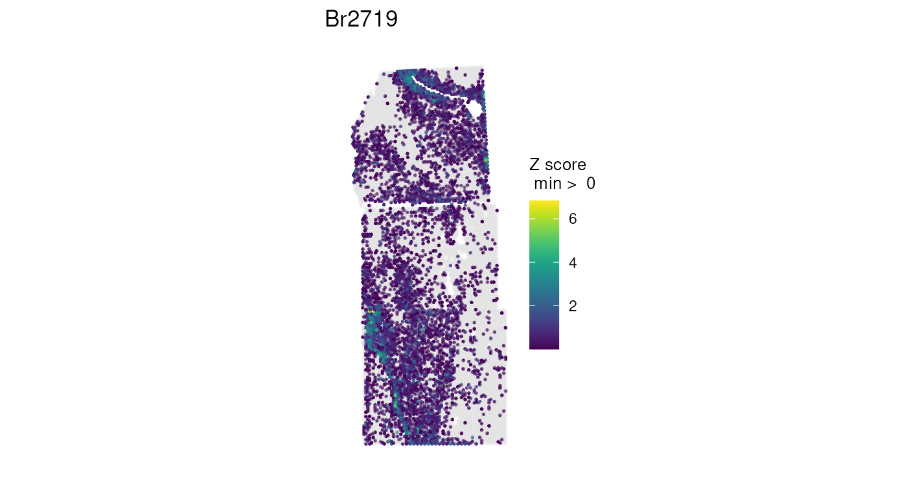
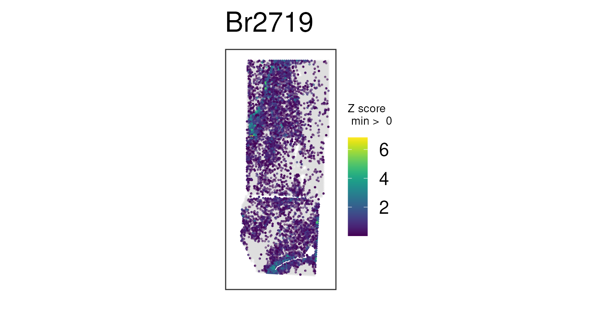
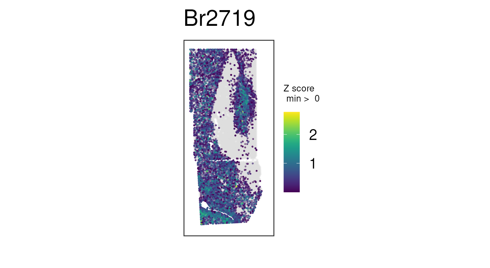
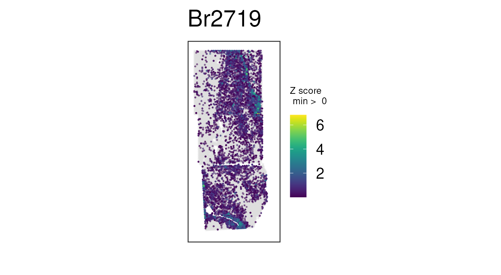

# Miscellaneous notes

This vignette has some extra companion notes to the *Introduction to
`visiumStiched`* main vignette.

## Load data

Let’s load the `spatialLIBD` package we’ll use in this vignette.

``` r

library("spatialLIBD")
```

Now we can download the example `visiumStitched_brain` data that
includes normalized `logcounts`. We’ll define the same example white
matter marker genes.

``` r

## Grab SpatialExperiment with normalized counts
spe <- fetch_data(type = "visiumStitched_brain_spe")
#> 2026-04-01 15:05:21.052786 loading file /github/home/.cache/R/BiocFileCache/524411ae5eee_visiumStitched_brain_spe.rds%3Frlkey%3Dnq6a82u23xuu9hohr86oodwdi%26dl%3D1

## Check that spe does contain the "logcounts" assay
assayNames(spe)
#> [1] "counts"    "logcounts"

## Define white matter marker genes
wm_genes <- rownames(spe)[
    match(c("MBP", "GFAP", "PLP1", "AQP4"), rowData(spe)$gene_name)
]
```

## Geometric transformations notes

As a `SpatialExperiment`, the stitched data you constructed with
[`visiumStitched::build_SpatialExperiment()`](../reference/build_SpatialExperiment.md)
may need to be rotated or mirrored by group. This can be done using the
[`SpatialExperiment::rotateObject()`](https://rdrr.io/pkg/SpatialExperiment/man/SpatialExperiment-rotate-mirror.html)
or
[`SpatialExperiment::mirrorObject()`](https://rdrr.io/pkg/SpatialExperiment/man/SpatialExperiment-rotate-mirror.html)
functions. These functions are useful in case the image needs to be
transformed to reach the preferred tissue orientation.

``` r

## Rotate image and gene-expression data by 180 degrees, plotting a combination
## of white-matter genes
vis_gene(
    rotateObject(spe, sample_id = "Br2719", degrees = 180),
    geneid = wm_genes,
    assayname = "counts",
    is_stitched = TRUE,
    spatial = FALSE
)
```



``` r

## Mirror image and gene-expression data across a vertical axis, plotting a
## combination of white-matter genes
vis_gene(
    mirrorObject(spe, sample_id = "Br2719", axis = "v"),
    geneid = wm_genes,
    assayname = "counts",
    is_stitched = TRUE,
    spatial = FALSE
)
```



You might want to re-make these plots with `spatial = TRUE` so you can
see how the histology image gets rotated and/or mirrored. For file size
purposes of this vignette, here we had to use `spatial = FALSE`.

### A note on normalization

As noted [in the main
vignette](https://research.libd.org/visiumStitched/articles/visiumStitched.html#stitched-plotting),
library-size variation across spots can bias the apparent spatial
distribution of genes when raw counts are used. The effect is often
dramatic enough that spatial trends cannot be easily seen across the
stitched data until data is log-normalized. Instead of performing
normalization here, we’ll fetch the object with
[normalized](https://bioconductor.org/books/3.19/OSCA.basic/normalization.html#normalization-by-deconvolution)
counts from `spatialLIBD`, then plot a few white matter genes as before:

``` r

## Plot combination of normalized counts for some white-matter genes
vis_gene(
    spe,
    geneid = wm_genes,
    assayname = "logcounts",
    is_stitched = TRUE,
    spatial = FALSE
)
```



Recall the unnormalized version of this plot, which is not nearly as
clean:

``` r

## Plot raw counts, which are noisier
## Same plot we made before, but this time with no histology images
vis_gene(
    spe,
    geneid = wm_genes,
    assayname = "counts",
    is_stitched = TRUE,
    spatial = FALSE
)
```



The actual normalization code for this example data is available
[here](https://github.com/LieberInstitute/visiumStitched_brain/blob/01eae0b12848b4ecbb6fe2dc9c07ad4257df3e47/code/03_stitching/02_build_SpatialExperiment.R#L43-L76).

## Merging overlapping spots

In general, we recommend retaining all spots for downstream analysis,
even if that means including multiple spots per array coordinate. [We
show](http://research.libd.org/visiumStitched/articles/visiumStitched.html#downstream-applications)
that many software tools, such as BayesSpace and PRECAST, can smoothly
handle data in this format. However, given that having multiple spots at
the same array coordinates is atypical in Visium experiments, we caution
that it’s possible some software may break or not perform as intended
with stitched data. We provide the
[`merge_overlapping()`](../reference/merge_overlapping.md) function to
address this case.

In particular,
[`merge_overlapping()`](../reference/merge_overlapping.md) sums raw
counts across spots that overlap, ultimately producing a
`SpatialExperiment` with one spot per array coordinate. `colData()`
information, both discrete and continuous, is taken from spots where
`exclude_overlapping` is `FALSE`. Note that the function can be quite
memory-intensive and time-consuming.

``` r

spe_merged <- merge_overlapping(spe)
```
