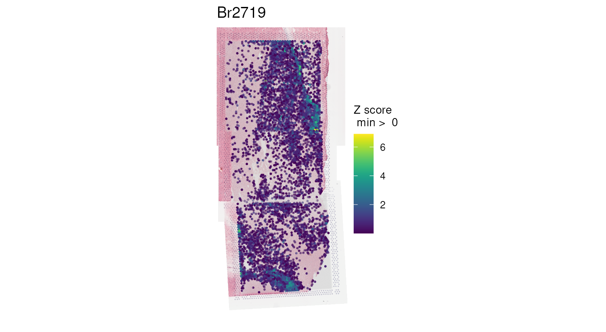
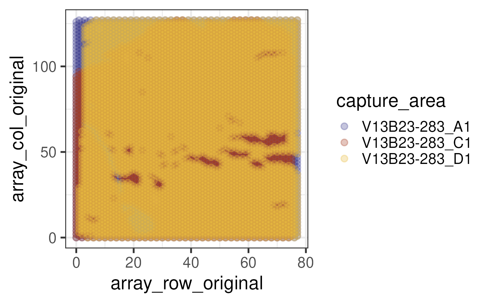
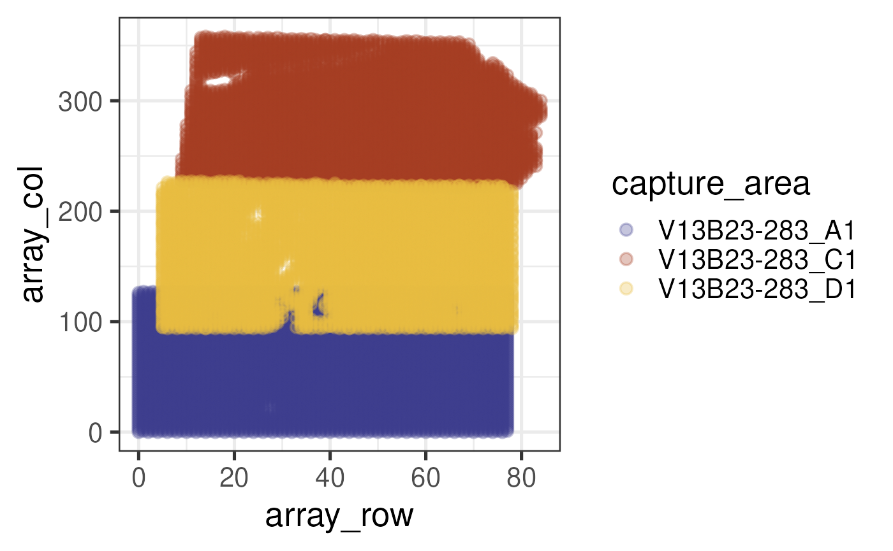
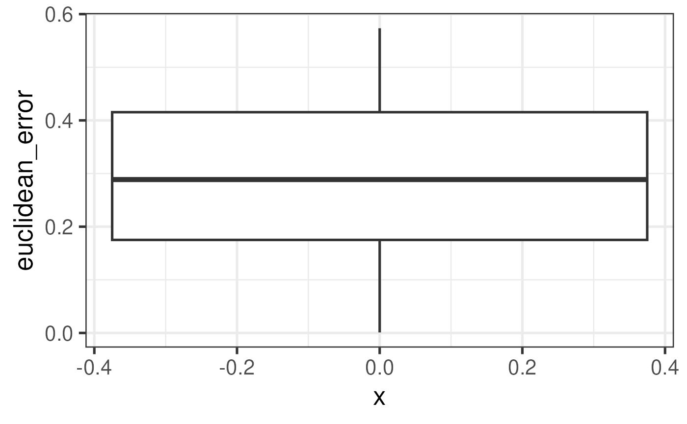
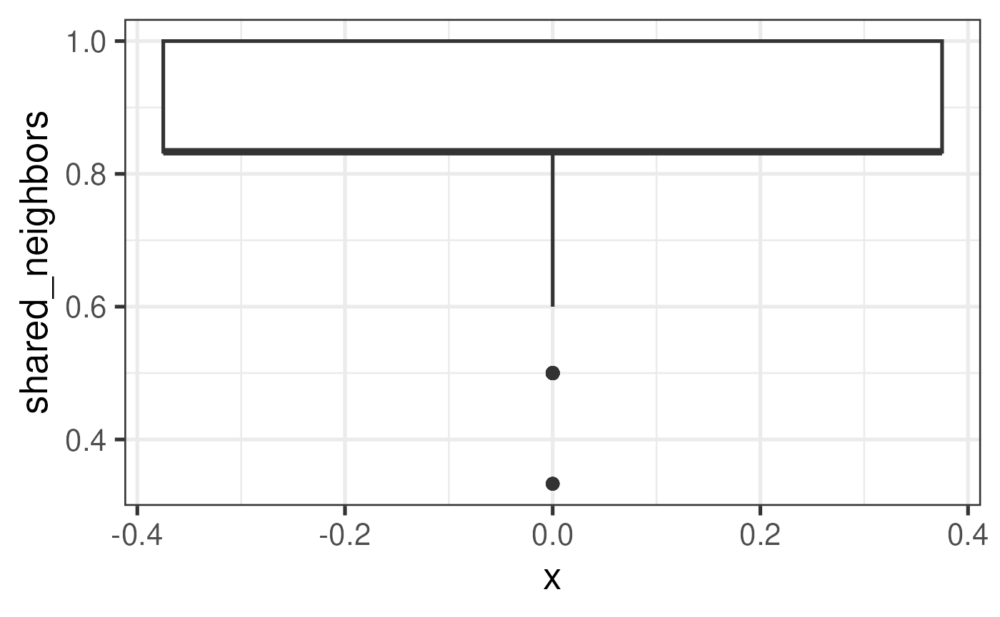
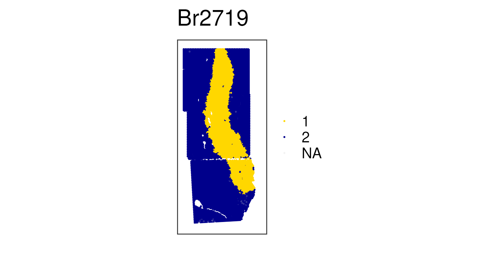
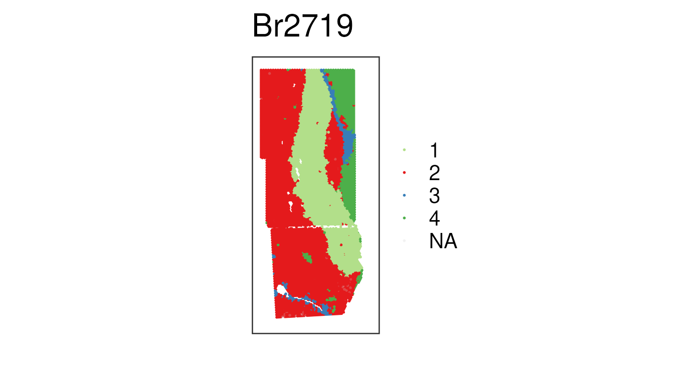

# Introduction to visiumStitched

## Basics

### Install `visiumStitched`

*[visiumStitched](https://bioconductor.org/packages/3.23/visiumStitched)*
is a Bioconductor `R` package that can be installed with the following
commands in your `R` session:

``` r

if (!requireNamespace("BiocManager", quietly = TRUE)) {
    install.packages("BiocManager")
}

BiocManager::install("visiumStitched")
```

### Citing `visiumStitched`

We hope that
*[visiumStitched](https://bioconductor.org/packages/3.23/visiumStitched)*
will be useful for your research. Please use the following information
to cite the package and the overall approach. Thank you!

``` r

## Citation info
citation("visiumStitched")
#> To cite package 'visiumStitched' in publications use:
#> 
#>   Eagles NJ, Collado-Torres L (2026). _Enable downstream analysis of
#>   Visium capture areas stitched together with Fiji_.
#>   doi:10.18129/B9.bioc.visiumStitched
#>   <https://doi.org/10.18129/B9.bioc.visiumStitched>.
#>   https://github.com/LieberInstitute/visiumStitched/visiumStitched - R
#>   package version 1.3.0,
#>   <http://www.bioconductor.org/packages/visiumStitched>.
#> 
#>   Eagles NJ, Bach S, Tippani M, Ravichandran P, Du Y, Miller RA, Hyde
#>   TM, Page SC, Martinowich K, Collado-Torres L (2024).
#>   "visiumStitched." _BMC Genomics_. doi:10.1186/s12864-024-10991-y
#>   <https://doi.org/10.1186/s12864-024-10991-y>.
#>   <doi.org/10.1186/s12864-024-10991-y>.
#> 
#> To see these entries in BibTeX format, use 'print(<citation>,
#> bibtex=TRUE)', 'toBibtex(.)', or set
#> 'options(citation.bibtex.max=999)'.
```

### Packages used in this vignette

Let’s load the packages we’ll use in this vignette.

``` r

library("SpatialExperiment")
library("visiumStitched")
library("dplyr")
library("spatialLIBD")
library("BiocFileCache")
library("ggplot2")
```

## Preparing Experiment Information

Much of the `visiumStitched` package uses a `tibble` (or `data.frame`)
defining information about the experiment. Most fundamentally, the
`group` column allows you to line up which capture areas, in the
`capture_area` column, are to be stitched together later. In our case,
we have just one unique group, consisting of all three capture areas.
Note multiple groups are supported. By the end of this demo, the
`SpatialExperiment` will consist of just one sample composed of the
three capture areas; in general, there will be one sample per group.

``` r

## Create initial sample_info
sample_info <- data.frame(
    group = "Br2719",
    capture_area = c("V13B23-283_A1", "V13B23-283_C1", "V13B23-283_D1")
)

## Initial sample_info
sample_info
#>    group  capture_area
#> 1 Br2719 V13B23-283_A1
#> 2 Br2719 V13B23-283_C1
#> 3 Br2719 V13B23-283_D1
```

Next, we’ll need the Spaceranger outputs for each capture area, which
can be retrieved with
[`spatialLIBD::fetch_data()`](https://rdrr.io/pkg/spatialLIBD/man/fetch_data.html).

``` r

## Download example SpaceRanger output files
sr_dir <- tempdir()
temp <- unzip(spatialLIBD::fetch_data("visiumStitched_brain_spaceranger"),
    exdir = sr_dir
)
#> 2026-04-01 15:05:48.115935 loading file /github/home/.cache/R/BiocFileCache/5244364f1fde_visiumStitched_brain_spaceranger.zip%3Frlkey%3Dbdgjc6mgy1ierdad6h6v5g29c%26dl%3D1
sample_info$spaceranger_dir <- file.path(
    sr_dir, sample_info$capture_area, "outs", "spatial"
)

## Sample_info with paths to SpaceRanger output directories
sample_info
#>    group  capture_area                            spaceranger_dir
#> 1 Br2719 V13B23-283_A1 /tmp/RtmpdwbM4P/V13B23-283_A1/outs/spatial
#> 2 Br2719 V13B23-283_C1 /tmp/RtmpdwbM4P/V13B23-283_C1/outs/spatial
#> 3 Br2719 V13B23-283_D1 /tmp/RtmpdwbM4P/V13B23-283_D1/outs/spatial
```

## Preparing Inputs to Fiji

The `visiumStitched` workflow makes use of
[Fiji](https://imagej.net/software/fiji/) 2.14.0, a distribution of the
`ImageJ` image-processing software, which includes an interface for
aligning images on a shared coordinate system. Before aligning anything
in Fiji, we need to ensure that images to align from all capture areas
are on the same scale– that is, a pixel in each image represents the
same distance. This is typically approximately true, but is not
guaranteed to be exactly true, especially when the capture areas to
align come from different Visium slides.
[`rescale_fiji_inputs()`](../reference/rescale_fiji_inputs.md) reads in
the [high-resolution tissue
images](https://www.10xgenomics.com/support/software/space-ranger/latest/analysis/outputs/spatial-outputs#tissue-png)
for each capture area, and uses info about their spot diameters in
pixels and scale factors to rescale the images appropriately (even if
they are from different Visium slides).

For demonstration purposes, we’ll set `out_dir` to a temporary location.
Typically, it would really be any suitable directory to place the
rescaled images for later input to Fiji.

``` r

#   Generate rescaled approximately high-resolution images
sample_info <- rescale_fiji_inputs(sample_info, out_dir = tempdir())

## Sample_info with output directories
sample_info
#> # A tibble: 3 × 5
#>   group  capture_area  spaceranger_dir     intra_group_scalar group_hires_scalef
#>   <chr>  <chr>         <chr>                            <dbl>              <dbl>
#> 1 Br2719 V13B23-283_A1 /tmp/RtmpdwbM4P/V1…               1.00             0.0825
#> 2 Br2719 V13B23-283_C1 /tmp/RtmpdwbM4P/V1…               1.00             0.0825
#> 3 Br2719 V13B23-283_D1 /tmp/RtmpdwbM4P/V1…               1                0.0825
```

## Building a `SpatialExperiment`

### Stitching Images with Fiji

Before building a `SpatialExperiment` for a stitched dataset, we must
align the images for each group in Fiji. Check out [this
video](https://www.youtube.com/watch?v=kFLtpK3qbSY) for a guide through
this process with the example data. Note that [Fiji version
2.14.0](https://downloads.imagej.net/fiji/releases/2.14.0/) was used in
this demo, and other versions have [behaved
differently](https://github.com/LieberInstitute/visiumStitched/issues/6).

# An error occurred.

Unable to execute JavaScript.

### Creating Group-Level Samples

From the Fiji alignment, two output files will be produced: an `XML`
file specifying rigid affine transformations for each capture area, and
the stitched approximately high-resolution image. These files for this
dataset are available through
[`spatialLIBD::fetch_data()`](https://rdrr.io/pkg/spatialLIBD/man/fetch_data.html).
We’ll need to add the paths to the XML and PNG files to the
`fiji_xml_path` and `fiji_image_path` columns of `sample_info`,
respectively.

``` r

fiji_dir <- tempdir()
temp <- unzip(fetch_data("visiumStitched_brain_Fiji_out"), exdir = fiji_dir)
#> 2026-04-01 15:06:01.702563 loading file /github/home/.cache/R/BiocFileCache/52444fc76ff3_visiumStitched_brain_fiji_out.zip%3Frlkey%3Dptwal8f5zxakzejwd0oqw0lhj%26dl%3D1
sample_info$fiji_xml_path <- temp[grep("xml$", temp)]
sample_info$fiji_image_path <- temp[grep("png$", temp)]
```

We now have every column present in `sample_info` that will be necessary
for any `visiumStitched` function.

``` r

## Complete sample_info
sample_info
#> # A tibble: 3 × 7
#>   group  capture_area  spaceranger_dir     intra_group_scalar group_hires_scalef
#>   <chr>  <chr>         <chr>                            <dbl>              <dbl>
#> 1 Br2719 V13B23-283_A1 /tmp/RtmpdwbM4P/V1…               1.00             0.0825
#> 2 Br2719 V13B23-283_C1 /tmp/RtmpdwbM4P/V1…               1.00             0.0825
#> 3 Br2719 V13B23-283_D1 /tmp/RtmpdwbM4P/V1…               1                0.0825
#> # ℹ 2 more variables: fiji_xml_path <chr>, fiji_image_path <chr>
```

Before building the `SpatialExperiment`, the idea is to create a
directory structure very similar to [Spaceranger’s spatial
outputs](https://www.10xgenomics.com/support/software/space-ranger/latest/analysis/outputs/spatial-outputs)
for each *group*, as opposed to the *capture-area*-level directories we
already have. We’ll place this directory in a temporary location that
will later be read in to produce the final `SpatialExperiment`.

First, [`prep_fiji_coords()`](../reference/prep_fiji.md) will apply the
rigid affine transformations specified by Fiji’s output XML file to the
spatial coordinates, ultimately producing a group-level
`tissue_positions.csv` file. Next,
[`prep_fiji_image()`](../reference/prep_fiji.md) will rescale the
stitched image to have a default of 1,200 pixels in the longest
dimension. The idea is that in an experiment with multiple groups, the
images stored in the `SpatialExperiment` for any group will be similarly
scaled and occupy similar memory footprints.

``` r

## Prepare the Fiji coordinates and images.
## These functions return the file paths to the newly-created files that follow
## the standard directory structure from SpaceRanger (10x Genomics)
spe_input_dir <- tempdir()
prep_fiji_coords(sample_info, out_dir = spe_input_dir)
#> [1] "/tmp/RtmpdwbM4P/Br2719/tissue_positions.csv"
prep_fiji_image(sample_info, out_dir = spe_input_dir)
#> [1] "/tmp/RtmpdwbM4P/Br2719/tissue_lowres_image.png"
#> [2] "/tmp/RtmpdwbM4P/Br2719/scalefactors_json.json"
```

### Constructing the Object

We now have all the pieces to create the `SpatialExperiment` object.
After constructing the base object, information related to how spots may
overlap between capture areas in each `group` is added. The `sum_umi`
metric will by default determine which spots in overlapping regions to
exclude in plots. In particular, at regions of overlap, spots from
capture areas with higher average UMI (unique molecular identifier)
counts will be plotted, while any other spots will not be shown using
[`spatialLIBD::vis_clus()`](https://rdrr.io/pkg/spatialLIBD/man/vis_clus.html),
[`spatialLIBD::vis_gene()`](https://rdrr.io/pkg/spatialLIBD/man/vis_gene.html),
and related visualization functions. We’ll also mirror the image and
gene-expression data to match the orientation specified at the wet
bench. More info about performing geometric transformations is
[here](#geometric-transformations).

``` r

## Download the Gencode v32 GTF file which is the closest one to the one
## that was used with SpaceRanger. Note that SpaceRanger GTFs are available at
## https://cf.10xgenomics.com/supp/cell-exp/refdata-gex-GRCh38-2024-A.tar.gz
## but is too large for us to download here since it includes many other files
## we don't need right now.
## However, ideally you would adapt this code and use the actual GTF file you
## used when running SpaceRanger.
bfc <- BiocFileCache::BiocFileCache()
gtf_cache <- bfcrpath(
    bfc,
    paste0(
        "ftp://ftp.ebi.ac.uk/pub/databases/gencode/Gencode_human/",
        "release_32/gencode.v32.annotation.gtf.gz"
    )
)
```

We’ll specify `algorithm = "Euclidean"` here for speed in this vignette,
though generally we recommend `algorithm = "LSAP"`. For a deeper
explanation on the implication of this choice, see the [Defining Array
Coordinates](#defining-array-coordinates) section.

``` r

## Now we can build the SpatialExperiment object. We'll later explore error
## metrics related to computing new array coordinates, and thus specify
## 'calc_error_metrics = TRUE'.
spe <- build_SpatialExperiment(
    sample_info,
    coords_dir = spe_input_dir, reference_gtf = gtf_cache,
    calc_error_metrics = TRUE, algorithm = "Euclidean"
)
#> Building SpatialExperiment using capture area as sample ID
#> 2026-04-01 15:06:04.777435 SpatialExperiment::read10xVisium: reading basic data from SpaceRanger
#> Warning in SpatialExperiment::read10xVisium(samples = samples, sample_id = sample_id, : 'SpatialExperiment::read10xVisium' is deprecated.
#> Use 'VisiumIO::TENxVisium(List)' instead.
#> See help("Deprecated")
#> 2026-04-01 15:06:08.613789 read10xVisiumAnalysis: reading analysis output from SpaceRanger
#> 2026-04-01 15:06:09.017669 add10xVisiumAnalysis: adding analysis output from SpaceRanger
#> 2026-04-01 15:06:09.301807 rtracklayer::import: reading the reference GTF file
#> 2026-04-01 15:06:37.312228 adding gene information to the SPE object
#> Warning: Gene IDs did not match. This typically happens when you are not using
#> the same GTF file as the one that was used by SpaceRanger. For example, one
#> file uses GENCODE IDs and the other one ENSEMBL IDs. read10xVisiumWrapper()
#> will try to convert them to ENSEMBL IDs.
#> Warning: Dropping 2226 out of 38606 genes for which we don't have information
#> on the reference GTF file. This typically happens when you are not using the
#> same GTF file as the one that was used by SpaceRanger.
#> 2026-04-01 15:06:37.494694 adding information used by spatialLIBD
#> Overwriting imgData(spe) with merged images (one per group)
#> Adding array coordinates with error metrics and adding overlap info

## The images in this example data have to be mirrored across the horizontal axis.
spe <- SpatialExperiment::mirrorObject(spe, axis = "h")

## Explore stitched spe object
spe
#> class: SpatialExperiment 
#> dim: 36380 14976 
#> metadata(0):
#> assays(1): counts
#> rownames(36380): ENSG00000243485.5 ENSG00000237613.2 ...
#>   ENSG00000198695.2 ENSG00000198727.2
#> rowData names(6): source type ... gene_type gene_search
#> colnames(14976): AAACAACGAATAGTTC-1_V13B23-283_A1
#>   AAACAAGTATCTCCCA-1_V13B23-283_A1 ... TTGTTTGTATTACACG-1_V13B23-283_D1
#>   TTGTTTGTGTAAATTC-1_V13B23-283_D1
#> colData names(33): sample_id in_tissue ... overlap_key
#>   exclude_overlapping
#> reducedDimNames(0):
#> mainExpName: NULL
#> altExpNames(0):
#> spatialCoords names(2) : pxl_col_in_fullres pxl_row_in_fullres
#> imgData names(4): sample_id image_id data scaleFactor
```

The `colData(spe)$exclude_overlapping` column controls which spots to
drop for visualization purposes. Note also that the `overlap_key` column
was added, which gives a comma-separated string of spot keys overlapping
each given spot, or the empty string otherwise. After spatial
clustering, the `overlap_key` information can be useful to check how
frequently overlapping spots are assigned the same cluster.

``` r

## Examine spots to exclude for plotting
table(spe$exclude_overlapping)
#> 
#> FALSE  TRUE 
#> 13426  1550
```

## Examining the stitched data

### Stitched plotting

To demonstrate that we’ve stitched both the gene expression and image
data successfully, we’ll use `spatialLIBD::vis_gene(is_stitched = TRUE)`
(version 1.17.8 or newer) to plot the distribution of white matter
spatially. For more context on human brain white matter spatial marker
genes, check [our previous work on this
subject](https://doi.org/10.1038/s41593-020-00787-0).

``` r

## Show combined raw expression of white-matter marker genes
wm_genes <- rownames(spe)[
    match(c("MBP", "GFAP", "PLP1", "AQP4"), rowData(spe)$gene_name)
]
vis_gene(spe, geneid = wm_genes, assayname = "counts", is_stitched = TRUE)
```



Note that we’re plotting raw counts; prior to normalization,
library-size variation across spots can bias the apparent distribution.
Later, we’ll show that normalization is critical to producing a visually
seamless transition between overlapping capture areas.

### Defining Array Coordinates

Given that the stitched data is larger than a default Visium capture
area, [`add_array_coords()`](../reference/add_array_coords.md) (which is
used internally by
[`build_SpatialExperiment()`](../reference/build_SpatialExperiment.md))
recomputed the array coordinates (i.e. `spe$array_row` and
`spe$array_col`) to more sensibly index the stitched data.

Let’s explain this in more detail. By definition, these array
coordinates (see [documentation from
10X](https://www.10xgenomics.com/support/software/space-ranger/latest/analysis/outputs/spatial-outputs#tissue-positions))
are integer indices of each spot on a Visium capture area, numbering the
typically 78 and 128 rows and columns, respectively, for a 6.5mm capture
area. The
[`build_SpatialExperiment()`](../reference/build_SpatialExperiment.md)
function retains each capture area’s original array coordinates,
`spe$array_row_original` and `spe$array_col_original`, but these are
typically not useful to represent our group-level, stitched data. In
fact, each stitched capture area has the same exact array coordinates,
despite having different spatial positions after stitching. We’ll take
in-tissue spots only and use transparency to emphasize the overlap among
capture areas:

``` r

## Plot positions of default array coordinates, before overwriting with more
## meaningful values. Use custom colors for each capture area
ca_colors <- c("#A33B20", "#e7bb41", "#3d3b8e")
names(ca_colors) <- c("V13B23-283_C1", "V13B23-283_D1", "V13B23-283_A1")

colData(spe) |>
    as_tibble() |>
    filter(in_tissue) |>
    ggplot(
        mapping = aes(
            x = array_row_original, y = array_col_original, color = capture_area
        )
    ) +
    geom_point(alpha = 0.3) +
    scale_color_manual(values = ca_colors)
```



Let’s contrast this with the array coordinates recomputed by
`visiumStitched`. Briefly, `visiumStitched` forms a new target
hexagonal, Visium-like grid spanning the space occupied by all capture
areas after stitching. Then, the true spot positions are fit to nearby
target spot positions and reindexed accordingly, resulting in spatially
meaningful values that apply at the group level for stitched data.

Two algorithms are available to perform this fitting and can be provided
to
[`build_SpatialExperiment()`](../reference/build_SpatialExperiment.md)
(and internally
[`add_array_coords()`](../reference/add_array_coords.md)) through the
`algorithm` parameter. The default and recommended choice is “LSAP”
(standing for linear sum assignment problem), a framing of the mapping
problem whose solution produces a one-to-one mapping of original spots
to target array coordinates (for a given capture area), and minimizes
Euclidean distance between original and target positions under that
constraint. This approach is slow (~1 minute per capture area), but
generally produces the most sensible results. The other option is
“Euclidean”, which simply assigns each original spot to the nearest
target spot. This approach is very fast, but counterintuitively can
result in both duplicate mappings and “holes” (target spots where one
would expect a mapping, but none exists), which are generally
undesirable downstream (e.g. for clustering).

``` r

## Plot positions of redefined array coordinates
colData(spe) |>
    as_tibble() |>
    filter(in_tissue) |>
    ggplot(
        mapping = aes(
            x = array_row, y = array_col, color = capture_area
        )
    ) +
    geom_point(alpha = 0.3) +
    scale_color_manual(values = ca_colors)
```



An important downstream application of these array coordinates, is that
it enables methods that rely on the hexagonal grid structure of Visium
to find more than the original six neighboring spots. This enables
clustering with
[`BayesSpace`](https://doi.org/10.1038/s41587-021-00935-2) or
[`PRECAST`](https://doi.org/10.1038/s41467-023-35947-w), to treat each
group as a spatially continuous sample. We can see here how
[`BayesSpace:::.find_neighbors()`](https://github.com/edward130603/BayesSpace/blob/8e9af8f2fa8e93518cf9ecee1ded9ab93e88fffd/R/spatialCluster.R#L214-L220)
version 1.11.0 uses the hexagonal Visium grid properties to find the
spot neighbors. See also [`BayesSpace` Figure
1b](https://www.nature.com/articles/s41587-021-00935-2/figures/1) for an
illustration of this process.

Yet, it doesn’t matter if there are actually two or more spots on each
of those six neighbor positions. `visiumStitched` takes advantage of
this property to enable `BayesSpace` and other spatially-aware
clustering methods to use data from overlapping spots when performing
spatial clustering. You can then use `colData(spe)$overlap_key` to
inspect whether overlapping spots were assigned to the same spatial
cluster.

#### Error metrics

No algorithm can fit a set of capture areas’ spots onto a single
hexagonal grid without some error. Here, we define a spot’s error in
being assigned new array coordinates with two independent metrics, which
are stored in `spe$euclidean_error` and `spe$shared_neighbors` if the
user opts to compute them with
`build_SpatialExperiment(calc_error_metrics = TRUE)`. The latter metric
can take a couple minutes to compute, and thus by default the metrics
are not computed.

The first metric is the Euclidean distance, in multiples of 100 microns
(the distance between spots on a Visium capture area), between a spot’s
original position and the position of its assigned array coordinates.

``` r

#   Explore the distribution of Euclidean error
colData(spe) |>
    as_tibble() |>
    ggplot(mapping = aes(x = 0, y = euclidean_error)) +
    geom_boxplot()
```



The other metric, `spe$shared_neighbors`, measures the fraction of
original neighbors (from a same capture area) that are retained after
mapping to the new array coordinates. Thus, a value of 1 is ideal.

``` r

#   Explore the distribution of Euclidean error
colData(spe) |>
    as_tibble() |>
    ggplot(mapping = aes(x = 0, y = shared_neighbors)) +
    geom_boxplot()
```



In theory, error as measured through these metrics could have a very
slight impact on the quality of clustering results downstream. We
envision interested users in checking these metrics when interpreting
specific spots’ cluster assignments downstream.

## Downstream applications

One common area of analysis in spatial transcriptomics involves
clustering– in particular, spatially-aware clustering. Many
spatially-aware clustering algorithms check the array coordinates to
determine neighboring spots and ultimately produce spatially smooth
clusters. As we have previously explained, `visiumStitched` [re-computes
array coordinates](#array-coordinates) in a meaningful way, such that
software like [`BayesSpace`](https://doi.org/10.1038/s41587-021-00935-2)
and [`PRECAST`](https://doi.org/10.1038/s41467-023-35947-w) work
out-of-the-box with stitched data, treating each group as a single
continuous sample.

[We’ve already run
PRECAST](https://github.com/LieberInstitute/visiumStitched_brain/blob/devel/code/03_stitching/06_precast.R),
and can visualize the results here, where we see a fairly seamless
transition of cluster assignments across capture-area boundaries. First,
let’s examine `k = 2`:

``` r

## Grab SpatialExperiment with normalized counts
spe_norm <- fetch_data(type = "visiumStitched_brain_spe")
#> 2026-04-01 15:07:52.041009 loading file /github/home/.cache/R/BiocFileCache/524411ae5eee_visiumStitched_brain_spe.rds%3Frlkey%3Dnq6a82u23xuu9hohr86oodwdi%26dl%3D1
assayNames(spe_norm)
#> [1] "counts"    "logcounts"

## PRECAST k = 2 clusters with our manually chosen colors
vis_clus(
    spe_norm,
    clustervar = "precast_k2_stitched",
    is_stitched = TRUE,
    colors = c(
        "1" = "gold",
        "2" = "darkblue",
        "NA" = "white"
    ),
    spatial = FALSE
)
```



We can see that these two spatial clusters are differentiating the white
vs the gray matter based on the white matter marker genes we [previously
visualized](https://research.libd.org/visiumStitched/articles/visiumStitched.html#a-note-on-normalization).

In the example data, `k = 4` and `k = 8` have also been computed. Let’s
visualize the `k = 4` results.

``` r

## PRECAST results already available in this example data
vars <- colnames(colData(spe_norm))
vars[grep("precast", vars)]
#>  [1] "precast_k2_stitched"    "precast_k4_stitched"    "precast_k8_stitched"   
#>  [4] "precast_k16_stitched"   "precast_k24_stitched"   "precast_k2_unstitched" 
#>  [7] "precast_k4_unstitched"  "precast_k8_unstitched"  "precast_k16_unstitched"
#> [10] "precast_k24_unstitched"

## PRECAST k = 4 clusters with default cluster colors
vis_clus(
    spe_norm,
    clustervar = "precast_k4_stitched",
    is_stitched = TRUE,
    spatial = FALSE
)
```



The biological interpretation of these spatial clusters would need
further work, using methods such as:

- [spatial
  registration](https://research.libd.org/spatialLIBD/articles/guide_to_spatial_registration.html)
  of reference sc/snRNA-seq or spatial data,
- visualization of known marker genes for the tissue of interest,
- or identification of data driven marker genes using
  [`spatialLIBD::registration_wrapper()`](https://research.libd.org/spatialLIBD/reference/registration_wrapper.html),
  [`DeconvoBuddies::findMarkers_1vAll()`](https://research.libd.org/DeconvoBuddies/reference/findMarkers_1vAll.html),
  [`DeconvoBuiddies::get_mean_ratio()`](https://research.libd.org/DeconvoBuddies/reference/get_mean_ratio.html)
  or other tools. See [Pullin and McCarthy, *Genome Biol.*,
  2024](https://doi.org/10.1186/s13059-024-03183-0) for a list of marker
  gene selection methods.

## Conclusion

`visiumStitched` provides a set of helper functions, in conjunction with
`ImageJ`/`Fiji`, intended to simplify the stitching of Visium data into
a spatially integrated `SpatialExperiment` object ready for analysis. We
hope you find it useful for your research!

## Reproducibility

The
*[visiumStitched](https://bioconductor.org/packages/3.23/visiumStitched)*
package (Eagles and Collado-Torres, 2026) was made possible thanks to:

- R (R Core Team, 2026)
- *[BiocFileCache](https://bioconductor.org/packages/3.23/BiocFileCache)*
  (Shepherd and Morgan, 2025)
- *[BiocStyle](https://bioconductor.org/packages/3.23/BiocStyle)* (Oleś,
  2025)
- *[clue](https://CRAN.R-project.org/package=clue)* (Hornik, 2026)
- *[dplyr](https://CRAN.R-project.org/package=dplyr)* (Wickham,
  François, Henry, Müller, and Vaughan, 2026)
- *[DropletUtils](https://bioconductor.org/packages/3.23/DropletUtils)*
  (Lun, Riesenfeld, Andrews, Dao, Gomes, participants in the 1st Human
  Cell Atlas Jamboree, and Marioni, 2019)
- *[ggplot2](https://CRAN.R-project.org/package=ggplot2)* (Wickham,
  2016)
- *[imager](https://CRAN.R-project.org/package=imager)* (Barthelme,
  2025)
- *[knitr](https://CRAN.R-project.org/package=knitr)* (Xie, 2025)
- *[pkgcond](https://CRAN.R-project.org/package=pkgcond)* (Redd and R
  Documentation Task Force, 2021)
- *[RefManageR](https://CRAN.R-project.org/package=RefManageR)* (McLean,
  2017)
- *[rjson](https://CRAN.R-project.org/package=rjson)* (Couture-Beil,
  2024)
- *[rmarkdown](https://CRAN.R-project.org/package=rmarkdown)* (Allaire,
  Xie, Dervieux, McPherson, Luraschi, Ushey, Atkins, Wickham, Cheng,
  Chang, and Iannone, 2026)
- *[S4Vectors](https://bioconductor.org/packages/3.23/S4Vectors)*
  (Pagès, Lawrence, and Aboyoun, 2025)
- *[sessioninfo](https://CRAN.R-project.org/package=sessioninfo)*
  (Wickham, Chang, Flight, Müller, and Hester, 2025)
- *[Seurat](https://CRAN.R-project.org/package=Seurat)* (Hao, Stuart,
  Kowalski, Choudhary, Hoffman, Hartman, Srivastava, Molla, Madad,
  Fernandez-Granda, and Satija, 2023)
- *[SpatialExperiment](https://bioconductor.org/packages/3.23/SpatialExperiment)*
  (Righelli, Weber, Crowell, Pardo, Collado-Torres, Ghazanfar, Lun,
  Hicks, and Risso, 2022)
- *[spatialLIBD](https://bioconductor.org/packages/3.23/spatialLIBD)*
  (Pardo, Spangler, Weber, Hicks, Jaffe, Martinowich, Maynard, and
  Collado-Torres, 2022)
- *[stringr](https://CRAN.R-project.org/package=stringr)* (Wickham,
  2025)
- *[SummarizedExperiment](https://bioconductor.org/packages/3.23/SummarizedExperiment)*
  (Morgan, Obenchain, Hester, and Pagès, 2026)
- *[testthat](https://CRAN.R-project.org/package=testthat)* (Wickham,
  2011)
- *[xml2](https://CRAN.R-project.org/package=xml2)* (Wickham, Hester,
  and Ooms, 2026)

This package was developed using
*[biocthis](https://bioconductor.org/packages/3.23/biocthis)*.

Code for creating the vignette

``` r

## Create the vignette
library("rmarkdown")
system.time(render("visiumStitched.Rmd", "BiocStyle::html_document"))

## Extract the R code
library("knitr")
knit("visiumStitched.Rmd", tangle = TRUE)
```

`R` session information.

    #> ─ Session info ───────────────────────────────────────────────────────────────────────────────────────────────────────
    #>  setting  value
    #>  version  R Under development (unstable) (2026-03-28 r89738)
    #>  os       Ubuntu 24.04.4 LTS
    #>  system   x86_64, linux-gnu
    #>  ui       X11
    #>  language en
    #>  collate  en_US.UTF-8
    #>  ctype    en_US.UTF-8
    #>  tz       UTC
    #>  date     2026-04-01
    #>  pandoc   3.9.0.2 @ /usr/bin/ (via rmarkdown)
    #>  quarto   1.8.25 @ /usr/local/bin/quarto
    #> 
    #> ─ Packages ───────────────────────────────────────────────────────────────────────────────────────────────────────────
    #>  package              * version    date (UTC) lib source
    #>  abind                  1.4-8      2024-09-12 [1] CRAN (R 4.6.0)
    #>  AnnotationDbi          1.73.0     2025-10-31 [1] Bioconductor 3.23 (R 4.6.0)
    #>  AnnotationHub          4.1.0      2025-10-31 [1] Bioconductor 3.23 (R 4.6.0)
    #>  attempt                0.3.1      2020-05-03 [1] CRAN (R 4.6.0)
    #>  backports              1.5.0      2024-05-23 [1] CRAN (R 4.6.0)
    #>  beachmat               2.27.3     2026-02-27 [1] Bioconductor 3.23 (R 4.7.0)
    #>  beeswarm               0.4.0      2021-06-01 [1] CRAN (R 4.6.0)
    #>  benchmarkme            1.0.8      2022-06-12 [1] CRAN (R 4.6.0)
    #>  benchmarkmeData        2.0.0      2026-01-19 [1] CRAN (R 4.6.0)
    #>  bibtex                 0.5.2      2026-02-03 [1] CRAN (R 4.6.0)
    #>  Biobase              * 2.71.0     2025-10-30 [1] Bioconductor 3.23 (R 4.6.0)
    #>  BiocBaseUtils          1.13.0     2025-10-30 [1] Bioconductor 3.23 (R 4.6.0)
    #>  BiocFileCache        * 3.1.0      2025-10-30 [1] Bioconductor 3.23 (R 4.6.0)
    #>  BiocGenerics         * 0.57.0     2025-10-30 [1] Bioconductor 3.23 (R 4.6.0)
    #>  BiocIO                 1.21.0     2025-10-30 [1] Bioconductor 3.23 (R 4.6.0)
    #>  BiocManager            1.30.27    2025-11-14 [2] CRAN (R 4.7.0)
    #>  BiocNeighbors          2.5.4      2026-02-12 [1] Bioconductor 3.23 (R 4.7.0)
    #>  BiocParallel           1.45.0     2025-10-30 [1] Bioconductor 3.23 (R 4.6.0)
    #>  BiocSingular           1.27.1     2025-11-17 [1] Bioconductor 3.23 (R 4.6.0)
    #>  BiocStyle            * 2.39.0     2025-10-30 [1] Bioconductor 3.23 (R 4.6.0)
    #>  BiocVersion            3.23.1     2025-10-30 [2] Bioconductor 3.23 (R 4.7.0)
    #>  Biostrings             2.79.5     2026-03-06 [1] Bioconductor 3.23 (R 4.7.0)
    #>  bit                    4.6.0      2025-03-06 [1] CRAN (R 4.6.0)
    #>  bit64                  4.6.0-1    2025-01-16 [1] CRAN (R 4.6.0)
    #>  bitops                 1.0-9      2024-10-03 [1] CRAN (R 4.6.0)
    #>  blob                   1.3.0      2026-01-14 [1] CRAN (R 4.6.0)
    #>  bmp                    0.3.1      2025-09-22 [1] CRAN (R 4.6.0)
    #>  bookdown               0.46       2025-12-05 [1] CRAN (R 4.6.0)
    #>  bslib                  0.10.0     2026-01-26 [2] CRAN (R 4.7.0)
    #>  cachem                 1.1.0      2024-05-16 [2] CRAN (R 4.7.0)
    #>  cigarillo              1.1.0      2025-10-31 [1] Bioconductor 3.23 (R 4.6.0)
    #>  circlize               0.4.17     2025-12-08 [1] CRAN (R 4.6.0)
    #>  cli                    3.6.5      2025-04-23 [2] CRAN (R 4.7.0)
    #>  clue                   0.3-68     2026-03-26 [1] CRAN (R 4.7.0)
    #>  cluster                2.1.8.2    2026-02-05 [3] CRAN (R 4.7.0)
    #>  codetools              0.2-20     2024-03-31 [3] CRAN (R 4.7.0)
    #>  colorspace             2.1-2      2025-09-22 [1] CRAN (R 4.6.0)
    #>  ComplexHeatmap         2.27.1     2026-01-30 [1] Bioconductor 3.23 (R 4.6.0)
    #>  config                 0.3.2      2023-08-30 [1] CRAN (R 4.6.0)
    #>  cowplot                1.2.0      2025-07-07 [1] CRAN (R 4.6.0)
    #>  crayon                 1.5.3      2024-06-20 [2] CRAN (R 4.7.0)
    #>  curl                   7.0.0      2025-08-19 [2] CRAN (R 4.7.0)
    #>  data.table             1.18.2.1   2026-01-27 [1] CRAN (R 4.6.0)
    #>  DBI                    1.3.0      2026-02-25 [1] CRAN (R 4.7.0)
    #>  dbplyr               * 2.5.2      2026-02-13 [1] CRAN (R 4.7.0)
    #>  DelayedArray           0.37.0     2025-10-31 [1] Bioconductor 3.23 (R 4.6.0)
    #>  DelayedMatrixStats     1.33.0     2025-10-31 [1] Bioconductor 3.23 (R 4.6.0)
    #>  desc                   1.4.3      2023-12-10 [2] CRAN (R 4.7.0)
    #>  digest                 0.6.39     2025-11-19 [2] CRAN (R 4.7.0)
    #>  doParallel             1.0.17     2022-02-07 [1] CRAN (R 4.6.0)
    #>  dplyr                * 1.2.0      2026-02-03 [1] CRAN (R 4.6.0)
    #>  dqrng                  0.4.1      2024-05-28 [1] CRAN (R 4.6.0)
    #>  DropletUtils           1.31.0     2025-11-03 [1] Bioconductor 3.23 (R 4.6.0)
    #>  DT                     0.34.0     2025-09-02 [1] CRAN (R 4.6.0)
    #>  edgeR                  4.9.4      2026-03-02 [1] Bioconductor 3.23 (R 4.7.0)
    #>  evaluate               1.0.5      2025-08-27 [2] CRAN (R 4.7.0)
    #>  ExperimentHub          3.1.0      2025-10-31 [1] Bioconductor 3.23 (R 4.6.0)
    #>  farver                 2.1.2      2024-05-13 [1] CRAN (R 4.6.0)
    #>  fastmap                1.2.0      2024-05-15 [2] CRAN (R 4.7.0)
    #>  filelock               1.0.3      2023-12-11 [1] CRAN (R 4.6.0)
    #>  foreach                1.5.2      2022-02-02 [1] CRAN (R 4.6.0)
    #>  fs                     2.0.1      2026-03-24 [2] CRAN (R 4.7.0)
    #>  generics             * 0.1.4      2025-05-09 [1] CRAN (R 4.6.0)
    #>  GenomicAlignments      1.47.0     2025-10-31 [1] Bioconductor 3.23 (R 4.6.0)
    #>  GenomicRanges        * 1.63.1     2025-12-08 [1] Bioconductor 3.23 (R 4.6.0)
    #>  GetoptLong             1.1.0      2025-11-28 [1] CRAN (R 4.6.0)
    #>  ggbeeswarm             0.7.3      2025-11-29 [1] CRAN (R 4.6.0)
    #>  ggplot2              * 4.0.2      2026-02-03 [1] CRAN (R 4.6.0)
    #>  ggrepel                0.9.8      2026-03-17 [1] CRAN (R 4.7.0)
    #>  GlobalOptions          0.1.3      2025-11-28 [1] CRAN (R 4.6.0)
    #>  glue                   1.8.0      2024-09-30 [2] CRAN (R 4.7.0)
    #>  golem                  0.5.1      2024-08-27 [1] CRAN (R 4.6.0)
    #>  gridExtra              2.3        2017-09-09 [1] CRAN (R 4.6.0)
    #>  gtable                 0.3.6      2024-10-25 [1] CRAN (R 4.6.0)
    #>  h5mread                1.3.2      2026-03-08 [1] Bioconductor 3.23 (R 4.7.0)
    #>  HDF5Array              1.39.0     2025-10-31 [1] Bioconductor 3.23 (R 4.6.0)
    #>  hms                    1.1.4      2025-10-17 [1] CRAN (R 4.6.0)
    #>  htmltools              0.5.9      2025-12-04 [2] CRAN (R 4.7.0)
    #>  htmlwidgets            1.6.4      2023-12-06 [2] CRAN (R 4.7.0)
    #>  httpuv                 1.6.17     2026-03-18 [2] CRAN (R 4.7.0)
    #>  httr                   1.4.8      2026-02-13 [1] CRAN (R 4.7.0)
    #>  httr2                  1.2.2      2025-12-08 [2] CRAN (R 4.7.0)
    #>  igraph                 2.2.2      2026-02-12 [1] CRAN (R 4.7.0)
    #>  imager                 1.0.8      2025-12-23 [1] CRAN (R 4.6.0)
    #>  IRanges              * 2.45.0     2025-10-31 [1] Bioconductor 3.23 (R 4.6.0)
    #>  irlba                  2.3.7      2026-01-30 [1] CRAN (R 4.6.0)
    #>  iterators              1.0.14     2022-02-05 [1] CRAN (R 4.6.0)
    #>  jpeg                   0.1-11     2025-03-21 [1] CRAN (R 4.6.0)
    #>  jquerylib              0.1.4      2021-04-26 [2] CRAN (R 4.7.0)
    #>  jsonlite               2.0.0      2025-03-27 [2] CRAN (R 4.7.0)
    #>  KEGGREST               1.51.1     2025-11-17 [1] Bioconductor 3.23 (R 4.6.0)
    #>  knitr                  1.51       2025-12-20 [2] CRAN (R 4.7.0)
    #>  labeling               0.4.3      2023-08-29 [1] CRAN (R 4.6.0)
    #>  later                  1.4.8      2026-03-05 [2] CRAN (R 4.7.0)
    #>  lattice                0.22-9     2026-02-09 [3] CRAN (R 4.7.0)
    #>  lazyeval               0.2.2      2019-03-15 [1] CRAN (R 4.6.0)
    #>  lifecycle              1.0.5      2026-01-08 [2] CRAN (R 4.7.0)
    #>  limma                  3.67.0     2025-10-30 [1] Bioconductor 3.23 (R 4.6.0)
    #>  locfit                 1.5-9.12   2025-03-05 [1] CRAN (R 4.6.0)
    #>  lubridate              1.9.5      2026-02-04 [1] CRAN (R 4.6.0)
    #>  magick                 2.9.1      2026-02-28 [1] CRAN (R 4.7.0)
    #>  magrittr               2.0.4      2025-09-12 [2] CRAN (R 4.7.0)
    #>  Matrix                 1.7-5      2026-03-21 [3] CRAN (R 4.7.0)
    #>  MatrixGenerics       * 1.23.0     2025-10-30 [1] Bioconductor 3.23 (R 4.6.0)
    #>  matrixStats          * 1.5.0      2025-01-07 [1] CRAN (R 4.6.0)
    #>  memoise                2.0.1      2021-11-26 [2] CRAN (R 4.7.0)
    #>  mime                   0.13       2025-03-17 [2] CRAN (R 4.7.0)
    #>  otel                   0.2.0      2025-08-29 [2] CRAN (R 4.7.0)
    #>  paletteer              1.7.0      2026-01-08 [1] CRAN (R 4.6.0)
    #>  pillar                 1.11.1     2025-09-17 [2] CRAN (R 4.7.0)
    #>  pkgcond                0.1.1      2021-04-28 [1] CRAN (R 4.6.0)
    #>  pkgconfig              2.0.3      2019-09-22 [2] CRAN (R 4.7.0)
    #>  pkgdown                2.2.0.9000 2026-04-01 [1] Github (r-lib/pkgdown@a6abe43)
    #>  plotly                 4.12.0     2026-01-24 [1] CRAN (R 4.6.0)
    #>  plyr                   1.8.9      2023-10-02 [1] CRAN (R 4.6.0)
    #>  png                    0.1-9      2026-03-15 [1] CRAN (R 4.7.0)
    #>  promises               1.5.0      2025-11-01 [2] CRAN (R 4.7.0)
    #>  purrr                  1.2.1      2026-01-09 [2] CRAN (R 4.7.0)
    #>  R.methodsS3            1.8.2      2022-06-13 [1] CRAN (R 4.6.0)
    #>  R.oo                   1.27.1     2025-05-02 [1] CRAN (R 4.6.0)
    #>  R.utils                2.13.0     2025-02-24 [1] CRAN (R 4.6.0)
    #>  R6                     2.6.1      2025-02-15 [2] CRAN (R 4.7.0)
    #>  ragg                   1.5.2      2026-03-23 [2] CRAN (R 4.7.0)
    #>  rappdirs               0.3.4      2026-01-17 [2] CRAN (R 4.7.0)
    #>  RColorBrewer           1.1-3      2022-04-03 [1] CRAN (R 4.6.0)
    #>  Rcpp                   1.1.1      2026-01-10 [2] CRAN (R 4.7.0)
    #>  RCurl                  1.98-1.18  2026-03-21 [1] CRAN (R 4.7.0)
    #>  readbitmap             0.1.5      2018-06-27 [1] CRAN (R 4.6.0)
    #>  readr                  2.2.0      2026-02-19 [1] CRAN (R 4.7.0)
    #>  RefManageR           * 1.4.0      2022-09-30 [1] CRAN (R 4.6.0)
    #>  rematch2               2.1.2      2020-05-01 [1] CRAN (R 4.6.0)
    #>  restfulr               0.0.16     2025-06-27 [1] CRAN (R 4.6.0)
    #>  rhdf5                  2.55.16    2026-03-12 [1] Bioconductor 3.23 (R 4.7.0)
    #>  rhdf5filters           1.23.3     2025-12-07 [1] Bioconductor 3.23 (R 4.6.0)
    #>  Rhdf5lib               1.33.6     2026-03-16 [1] Bioconductor 3.23 (R 4.7.0)
    #>  rjson                  0.2.23     2024-09-16 [1] CRAN (R 4.6.0)
    #>  rlang                  1.1.7      2026-01-09 [2] CRAN (R 4.7.0)
    #>  rmarkdown              2.31       2026-03-26 [2] CRAN (R 4.7.0)
    #>  Rsamtools              2.27.1     2026-03-08 [1] Bioconductor 3.23 (R 4.7.0)
    #>  RSQLite                2.4.6      2026-02-06 [1] CRAN (R 4.6.0)
    #>  rsvd                   1.0.5      2021-04-16 [1] CRAN (R 4.6.0)
    #>  rtracklayer            1.71.3     2025-12-14 [1] Bioconductor 3.23 (R 4.6.0)
    #>  S4Arrays               1.11.1     2025-11-25 [1] Bioconductor 3.23 (R 4.6.0)
    #>  S4Vectors            * 0.49.0     2025-10-30 [1] Bioconductor 3.23 (R 4.6.0)
    #>  S7                     0.2.1      2025-11-14 [1] CRAN (R 4.6.0)
    #>  sass                   0.4.10     2025-04-11 [2] CRAN (R 4.7.0)
    #>  ScaledMatrix           1.19.0     2025-10-31 [1] Bioconductor 3.23 (R 4.6.0)
    #>  scales                 1.4.0      2025-04-24 [1] CRAN (R 4.6.0)
    #>  scater                 1.39.3     2026-03-20 [1] Bioconductor 3.23 (R 4.7.0)
    #>  scuttle                1.21.0     2025-11-03 [1] Bioconductor 3.23 (R 4.6.0)
    #>  Seqinfo              * 1.1.0      2025-10-31 [1] Bioconductor 3.23 (R 4.6.0)
    #>  sessioninfo          * 1.2.3      2025-02-05 [2] CRAN (R 4.7.0)
    #>  shape                  1.4.6.1    2024-02-23 [1] CRAN (R 4.6.0)
    #>  shiny                  1.13.0     2026-02-20 [2] CRAN (R 4.7.0)
    #>  shinyWidgets           0.9.1      2026-03-09 [1] CRAN (R 4.7.0)
    #>  SingleCellExperiment * 1.33.2     2026-03-24 [1] Bioconductor 3.23 (R 4.7.0)
    #>  SparseArray            1.11.12    2026-03-30 [1] Bioconductor 3.23 (R 4.7.0)
    #>  sparseMatrixStats      1.23.0     2025-10-30 [1] Bioconductor 3.23 (R 4.6.0)
    #>  SpatialExperiment    * 1.21.0     2025-11-03 [1] Bioconductor 3.23 (R 4.6.0)
    #>  spatialLIBD          * 1.23.2     2026-04-01 [1] Github (LieberInstitute/spatialLIBD@e4921b4)
    #>  statmod                1.5.1      2025-10-09 [1] CRAN (R 4.6.0)
    #>  stringi                1.8.7      2025-03-27 [2] CRAN (R 4.7.0)
    #>  stringr                1.6.0      2025-11-04 [2] CRAN (R 4.7.0)
    #>  SummarizedExperiment * 1.41.1     2026-02-06 [1] Bioconductor 3.23 (R 4.6.0)
    #>  systemfonts            1.3.2      2026-03-05 [2] CRAN (R 4.7.0)
    #>  textshaping            1.0.5      2026-03-06 [2] CRAN (R 4.7.0)
    #>  tibble                 3.3.1      2026-01-11 [2] CRAN (R 4.7.0)
    #>  tidyr                  1.3.2      2025-12-19 [1] CRAN (R 4.6.0)
    #>  tidyselect             1.2.1      2024-03-11 [1] CRAN (R 4.6.0)
    #>  tiff                   0.1-12     2023-11-28 [1] CRAN (R 4.6.0)
    #>  timechange             0.4.0      2026-01-29 [1] CRAN (R 4.6.0)
    #>  tzdb                   0.5.0      2025-03-15 [1] CRAN (R 4.6.0)
    #>  utf8                   1.2.6      2025-06-08 [2] CRAN (R 4.7.0)
    #>  vctrs                  0.7.2      2026-03-21 [2] CRAN (R 4.7.0)
    #>  vipor                  0.4.7      2023-12-18 [1] CRAN (R 4.6.0)
    #>  viridis                0.6.5      2024-01-29 [1] CRAN (R 4.6.0)
    #>  viridisLite            0.4.3      2026-02-04 [1] CRAN (R 4.6.0)
    #>  visiumStitched       * 1.3.0      2026-04-01 [1] Bioconductor
    #>  vroom                  1.7.1      2026-03-31 [1] CRAN (R 4.7.0)
    #>  withr                  3.0.2      2024-10-28 [2] CRAN (R 4.7.0)
    #>  xfun                   0.57       2026-03-20 [2] CRAN (R 4.7.0)
    #>  XML                    3.99-0.23  2026-03-20 [1] CRAN (R 4.7.0)
    #>  xml2                   1.5.2      2026-01-17 [2] CRAN (R 4.7.0)
    #>  xtable                 1.8-8      2026-02-22 [2] CRAN (R 4.7.0)
    #>  XVector                0.51.0     2025-10-31 [1] Bioconductor 3.23 (R 4.6.0)
    #>  yaml                   2.3.12     2025-12-10 [2] CRAN (R 4.7.0)
    #> 
    #>  [1] /__w/_temp/Library
    #>  [2] /usr/local/lib/R/site-library
    #>  [3] /usr/local/lib/R/library
    #>  * ── Packages attached to the search path.
    #> 
    #> ──────────────────────────────────────────────────────────────────────────────────────────────────────────────────────

## Bibliography

This vignette was generated using
*[BiocStyle](https://bioconductor.org/packages/3.23/BiocStyle)* (Oleś,
2025) with *[knitr](https://CRAN.R-project.org/package=knitr)* (Xie,
2025) and *[rmarkdown](https://CRAN.R-project.org/package=rmarkdown)*
(Allaire, Xie, Dervieux et al., 2026) running behind the scenes.

Citations made with
*[RefManageR](https://CRAN.R-project.org/package=RefManageR)* (McLean,
2017).

[\[1\]](#cite-allaire2026rmarkdown) J. Allaire, Y. Xie, C. Dervieux, et
al. *rmarkdown: Dynamic Documents for R*. R package version 2.31. 2026.
URL: <https://github.com/rstudio/rmarkdown>.

[\[2\]](#cite-barthelme2025imager) S. Barthelme. *imager: Image
Processing Library Based on ‘CImg’*. R package version 1.0.8. 2025. DOI:
[10.32614/CRAN.package.imager](https://doi.org/10.32614/CRAN.package.imager).
URL: <https://CRAN.R-project.org/package=imager>.

[\[3\]](#cite-couturebeil2024rjson) A. Couture-Beil. *rjson: JSON for
R*. R package version 0.2.23. 2024. DOI:
[10.32614/CRAN.package.rjson](https://doi.org/10.32614/CRAN.package.rjson).
URL: <https://CRAN.R-project.org/package=rjson>.

[\[4\]](#cite-eagles2026enable) N. J. Eagles and L. Collado-Torres.
*Enable downstream analysis of Visium capture areas stitched together
with Fiji*.
<https://github.com/LieberInstitute/visiumStitched/visiumStitched> - R
package version 1.3.0. 2026. DOI:
[10.18129/B9.bioc.visiumStitched](https://doi.org/10.18129/B9.bioc.visiumStitched).
URL: <http://www.bioconductor.org/packages/visiumStitched>.

[\[5\]](#cite-hao2023dictionary) Y. Hao, T. Stuart, M. H. Kowalski, et
al. “Dictionary learning for integrative, multimodal and scalable
single-cell analysis”. In: *Nature Biotechnology* (2023). DOI:
[10.1038/s41587-023-01767-y](https://doi.org/10.1038/s41587-023-01767-y).
URL: <https://doi.org/10.1038/s41587-023-01767-y>.

[\[6\]](#cite-hornik2026clue) K. Hornik. *clue: Cluster Ensembles*. R
package version 0.3-68. 2026. DOI:
[10.32614/CRAN.package.clue](https://doi.org/10.32614/CRAN.package.clue).
URL: <https://CRAN.R-project.org/package=clue>.

[\[7\]](#cite-lun2019emptydrops) A. T. L. Lun, S. Riesenfeld, T.
Andrews, et al. “EmptyDrops: distinguishing cells from empty droplets in
droplet-based single-cell RNA sequencing data”. In: *Genome Biol.* 20
(2019), p. 63. DOI:
[10.1186/s13059-019-1662-y](https://doi.org/10.1186/s13059-019-1662-y).

[\[8\]](#cite-mclean2017refmanager) M. W. McLean. “RefManageR: Import
and Manage BibTeX and BibLaTeX References in R”. In: *The Journal of
Open Source Software* (2017). DOI:
[10.21105/joss.00338](https://doi.org/10.21105/joss.00338).

[\[9\]](#cite-morgan2026summarizedexperiment) M. Morgan, V. Obenchain,
J. Hester, et al. *SummarizedExperiment: A container (S4 class) for
matrix-like assays*. R package version 1.41.1. 2026. DOI:
[10.18129/B9.bioc.SummarizedExperiment](https://doi.org/10.18129/B9.bioc.SummarizedExperiment).
URL: <https://bioconductor.org/packages/SummarizedExperiment>.

[\[10\]](#cite-ole2025biocstyle) A. Oleś. *BiocStyle: Standard styles
for vignettes and other Bioconductor documents*. R package version
2.39.0. 2025. DOI:
[10.18129/B9.bioc.BiocStyle](https://doi.org/10.18129/B9.bioc.BiocStyle).
URL: <https://bioconductor.org/packages/BiocStyle>.

[\[11\]](#cite-pags2025s4vectors) H. Pagès, M. Lawrence, and P. Aboyoun.
*S4Vectors: Foundation of vector-like and list-like containers in
Bioconductor*. R package version 0.49.0. 2025. DOI:
[10.18129/B9.bioc.S4Vectors](https://doi.org/10.18129/B9.bioc.S4Vectors).
URL: <https://bioconductor.org/packages/S4Vectors>.

[\[12\]](#cite-pardo2022spatiallibd) B. Pardo, A. Spangler, L. M. Weber,
et al. “spatialLIBD: an R/Bioconductor package to visualize
spatially-resolved transcriptomics data”. In: *BMC Genomics* (2022).
DOI:
[10.1186/s12864-022-08601-w](https://doi.org/10.1186/s12864-022-08601-w).
URL: <https://doi.org/10.1186/s12864-022-08601-w>.

[\[13\]](#cite-2026language) R Core Team. *R: A Language and Environment
for Statistical Computing*. R Foundation for Statistical Computing (ROR:
\<<https://ror.org/05qewa988%3E>;). Vienna, Austria, 2026. DOI:
[10.32614/R.manuals](https://doi.org/10.32614/R.manuals). URL:
<https://www.R-project.org/>.

[\[14\]](#cite-redd2021pkgcond) A. Redd and R Documentation Task Force.
*pkgcond: Classed Error and Warning Conditions*. R package version
0.1.1. 2021. DOI:
[10.32614/CRAN.package.pkgcond](https://doi.org/10.32614/CRAN.package.pkgcond).
URL: <https://CRAN.R-project.org/package=pkgcond>.

[\[15\]](#cite-righelli2022spatialexperiment) D. Righelli, L. M. Weber,
H. L. Crowell, et al. “SpatialExperiment: infrastructure for
spatially-resolved transcriptomics data in R using Bioconductor”. In:
*Bioinformatics* 38.11 (2022), pp. -3. DOI:
[https://doi.org/10.1093/bioinformatics/btac299](https://doi.org/https://doi.org/10.1093/bioinformatics/btac299).

[\[16\]](#cite-shepherd2025biocfilecache) L. Shepherd and M. Morgan.
*BiocFileCache: Manage Files Across Sessions*. R package version 3.1.0.
2025. DOI:
[10.18129/B9.bioc.BiocFileCache](https://doi.org/10.18129/B9.bioc.BiocFileCache).
URL: <https://bioconductor.org/packages/BiocFileCache>.

[\[17\]](#cite-wickham2016ggplot2) H. Wickham. *ggplot2: Elegant
Graphics for Data Analysis*. Springer-Verlag New York, 2016. ISBN:
978-3-319-24277-4. URL: <https://ggplot2.tidyverse.org>.

[\[18\]](#cite-wickham2025stringr) H. Wickham. *stringr: Simple,
Consistent Wrappers for Common String Operations*. R package version
1.6.0. 2025. DOI:
[10.32614/CRAN.package.stringr](https://doi.org/10.32614/CRAN.package.stringr).
URL: <https://CRAN.R-project.org/package=stringr>.

[\[19\]](#cite-wickham2011testthat) H. Wickham. “testthat: Get Started
with Testing”. In: *The R Journal* 3 (2011), pp. 5–10. URL:
<https://journal.r-project.org/articles/RJ-2011-002/>.

[\[20\]](#cite-wickham2025sessioninfo) H. Wickham, W. Chang, R. Flight,
et al. *sessioninfo: R Session Information*. R package version 1.2.3.
2025. DOI:
[10.32614/CRAN.package.sessioninfo](https://doi.org/10.32614/CRAN.package.sessioninfo).
URL: <https://CRAN.R-project.org/package=sessioninfo>.

[\[21\]](#cite-wickham2026dplyr) H. Wickham, R. François, L. Henry, et
al. *dplyr: A Grammar of Data Manipulation*. R package version 1.2.0.
2026. DOI:
[10.32614/CRAN.package.dplyr](https://doi.org/10.32614/CRAN.package.dplyr).
URL: <https://CRAN.R-project.org/package=dplyr>.

[\[22\]](#cite-wickham2026xml2) H. Wickham, J. Hester, and J. Ooms.
*xml2: Parse XML*. R package version 1.5.2. 2026. DOI:
[10.32614/CRAN.package.xml2](https://doi.org/10.32614/CRAN.package.xml2).
URL: <https://CRAN.R-project.org/package=xml2>.

[\[23\]](#cite-xie2025knitr) Y. Xie. *knitr: A General-Purpose Package
for Dynamic Report Generation in R*. R package version 1.51. 2025. URL:
<https://yihui.org/knitr/>.
